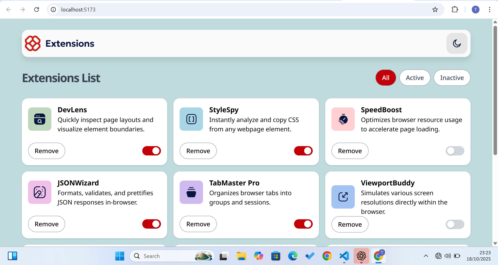

# Frontend Mentor - Browser extensions manager UI solution

This is a solution to the [Browser extensions manager UI challenge on Frontend Mentor](https://www.frontendmentor.io/challenges/browser-extension-manager-ui-yNZnOfsMAp). Frontend Mentor challenges help you improve your coding skills by building realistic projects.

## Table of contents

- [Overview](#overview)
  - [The challenge](#the-challenge)
  - [Screenshot](#screenshot)
  - [Links](#links)
- [My process](#my-process)
  - [Built with](#built-with)
  - [What I learned](#what-i-learned)
  - [Continued development](#continued-development)
  - [Useful resources](#useful-resources)
- [Author](#author)

## Overview

### The challenge

Users should be able to:

- Toggle extensions between active and inactive states
- Filter active and inactive extensions
- Remove extensions from the list
- Select their color theme
- View the optimal layout for the interface depending on their device's screen size
- See hover and focus states for all interactive elements on the page

### Screenshot



### Links

- Solution URL: [My Github solution](https://github.com/justtimi/browser-extensions-manager-ui)
- Live Site URL: [My solution URL](https://browser-extensions-manager-ui-fem.netlify.app/)

## My process

### Built with

- React
- Tailwind CSS
- Semantic HTML5 markup
- CSS custom properties
- CSS Grid

### What I learned

I learnt a lot in this fun and exciting challenge, and I would be going through each of them one by one. The first thing was that I was supposed to get my data from the [data.json file](public/data.json). Of course, I could have chosen to hardcode in the values, but as developers, we shouldnt just try solutions that work, but actually stand the test of time, easy to update and use. We should strive for the best working solution.
And I didnt have any experience with fetching data from an external source or using an API. That was when I decide to learn it once and for all after I had been pushing it all time.

Honestly, this was the first time that I actually understood the **useEffect()** hook in detail and how it is used to fetch data. I larnt the difference between trying to use file importing from the [src](src/) folder and using fetch method and placing the [data.json file](public/data.json) in the public folder. Turns out that files in the public folder dont get bundled up, so when React runs teh project, it fetches the data at runtime, while for importing, it displays the data at build time. And this was something that changed the way that I thought about data display. Because if it was something that I just wanted to display, as in predefined, I am not adding in any extra data or anything, importing from the [src](src/) folder would be okay. But if I wanted to be able to add in data and dynamically display that data on the screen, using the **fetch()** method would be a lot better.

```js
const [extensions, setExtensions] = useState([]);

useEffect(() => {
  fetch("/data.json")
    .then((response) => response.json())
    .then((data) => setExtensions(data))
    .catch((err) => console.error("Error checking JSON: ", err));
}, []);
```

Another thing was in styling. Tailwind certainly made it a lot easier. This was my first time using the **:theme** option in tailwind and also actually using the font files given by Frontend Mentor.Because normally, I just decide to embed the font by using the links from Google fonts and putting them directly into the project. But this time, I wanted to push myself out of my comfort zone, so I learnt to display the fonts using the font file. So I learnt that, and it was insightful

```css
@font-face {
  font-family: 'NotoSans';
  src: url('./assets/fonts/NotoSans-VariableFont_wdth,wght.ttf') format('truetype');
  font-weight: 400 700;  
  font-style: normal;
}

@theme{
  --font-noto: NotoSans, sans-serif;
}
```

I also did a lot of passing down of state and it got confusing and even messy at some point, because of I was supposed to traget the toggles to make sure that they dont just change state temporarily but teh state should persist and it should reflect in the data. 

### Continued development

I am still really trying to study how to pass state from the parent components to child components, and I feel that it is something that I would be using a lot. So thats an idea that I am looking forward to improving in.

Then, although not right now, because I still ahve a lot on my plate, but later on, I woud like to learn asynchronous programming with JavaScript in fuller detail, so that I can work with APIs efficiently and effectively. 

### Useful resources

- [Example resource 1](https://www.example.com) - This helped me for XYZ reason. I really liked this pattern and will use it going forward.
- [Example resource 2](https://www.example.com) - This is an amazing article which helped me finally understand XYZ. I'd recommend it to anyone still learning this concept.

## Author

- Website - [Timileyin Afolayan](https://www.your-site.com)
- Frontend Mentor - [@yourusername](https://www.frontendmentor.io/profile/yourusername)
- LinkedIn - [@yourusername](https://www.twitter.com/yourusername)
